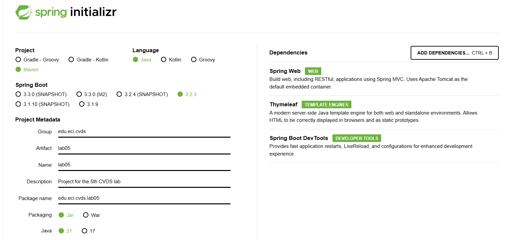

# Lab 05

## Tabla de Contenidos
- [Integrantes](#integrantes)
- [Respuestas](#respuestas)

## Integrantes
- Joan Steven Acevedo
- Miguel Ángel González Mahecha

## Respuestas

## Parte I
- ¿Qué pasa si no envío el método correcto?
  - Si no se envía el método correcto (por ejemplo, se utiliza GET en lugar de POST), el servidor responderá con un 
  código de estado HTTP 405 - Método no permitido (Method Not Allowed). Esto indica que el servidor no admite el método 
  HTTP utilizado en la solicitud.
- ¿Qué pasa si al body response HTML lo fuerzo a leerse como JSON?
  - El contenido pierde su highlighting
- ¿Por qué el preview de HTML no se ve igual a cuando accedo a la URL en un navegador web?
  - El preview de HTML en herramientas como Postman puede no verse igual que cuando accedes a la URL en un navegador web 
  debido a diferencias en la interpretación y renderizado del HTML. Postman proporciona una visualización básica del 
  HTML, mientras que los navegadores web utilizan motores de renderizado más sofisticados que pueden interpretar y 
  renderizar el HTML de manera más completa y precisa.
- ¿Qué pasa si le envías un body a una solicitud GET?
  - Según las especificaciones de HTTP, las solicitudes GET no deben tener un body. En la práctica, algunos servidores 
  pueden ignorar el body de una solicitud GET, mientras que otros pueden responder con un código de estado 
  400 - Solicitud incorrecta (Bad Request) si reciben un body en una solicitud GET. En general, es una buena 
  práctica evitar enviar bodies en solicitudes GET y utilizar métodos como POST o PUT para enviar datos al servidor.

### Parte II
- ¿Qué hace cada uno de los archivos en la aplicación?
```
  .
  ├── package.json              # contiene info sobre el proyecto y sus dependencias
  ├── public                    # Contiene archivos estáticos
  │   └── index.html            # El documento html que se sirve al cliente
  └── src                       # Código fuente
  ├── App.js                    # Utiliza JSX y los componentes para formar la calculadora
  ├── components                # Contiene los componentes reutilizables
  │   ├── KeyPadComponent.js    # Define el teclado de la calculadora cómo componente
  │   └── ResultComponent.js    # Define el espacio de resultado cómo componente
  ├── index.js                  # Inicializa React tomando el div con ID 'root'.
  └── styles.css                # Define los estilos que se aplican a los elementos html
```

Descargamos el código y ejecutamos ```npm install```. Este comando toma las dependencias declaradas en el
```package.json``` y las instala localmente.

Para correr la aplicación usando PowerShell:
```powershell
$env:NODE_OPTIONS='--openssl-legacy-provider' ; npm run start
```
En bash:
```shell
NODE_OPTIONS=--openssl-legacy-provider npm run start
```

- ¿El contenido que se sirve al usuario es dinámico o estático?
Al hacer una solicitud GET a http://localhost:3000 resivimos un HTML que solo difiere de ```public/index.html``` en
4 líneas del body
```html
<body>
<noscript>
    You need to enable JavaScript to run this app.
</noscript>
<div id="root"></div>
<!--
  Estas 4 script tags no están en el archivo public/index.html. Son agregadas por react.
-->
<script src="/static/js/bundle.js"></script>
<script src="/static/js/1.chunk.js"></script>
<script src="/static/js/main.chunk.js"></script>
<script src="/main.9efaefbf9dfe58338292.hot-update.js"></script>
</body>
```

Ahora vamos a eliminar los archivos de este proyecto de REACT para remplazarlos con los archivos de Spring Boot.
Cómo curiosidad, este es el comando que usamos en PowerShell
```powershell
Get-ChildItem | Where-Object { $_.Name -notlike "README.md" -and $_.Name -notlike ".gitignore" -and $_.Name -notlike ".git" } | Remove-Item -Force
```

Los archivos de esta parte del Lab están en un commit taggeado cómo 'Part2'.

## Parte III
Creamos un proyecto de Spring Boot con los siguientes parámetros


Luego la ejecutamos usando ```./mvnw spring:run```

Después procedimos a probar el funcionamiento. Las tres pruebas principales están en el archivo ```Tests.http```

- ¿Por qué MVC obtiene ese nombre? (puede apoyarse de https://www.javatpoint.com/spring-mvc-tutorial)
  - Porque en la arquitectura MVC tenemos tres componentes:
    - Model: Representa los datos y lógica de negocio de la app.
    - View: Es la representación visual de los datos contenidos en el modelo.
    - Controller: Es el intermediario entre el Model y el View
- ¿Cuáles son las ventajas de usar MVC?
  - Principalmente que se separan las responsabilidades. La lógica de la vista no se mezcla con la del modelo o la del
  controlador. Esto permite que cada capa evolucione de forma semi-independiente.
- ¿Qué diferencia tiene la estructura de directorios de este proyecto comparado con las de proyectos pasados 
(con solo maven y java EE)?
  - Por primera vez hacemos uso de los directorios ```/resources/static``` y ```/resources/templates```.
  - También tenemos el archivo ```./mvnw```. Un wrapper que nos permite usar maven para ejecutar el proyecto aún si
  no está instalado localmente.
- ¿Qué anotaciones usaste y cuál es la diferencia entre ellas?
  - @Controller: Especifíca que una clase funge cómo controlador. Es decir, recibe solicitudes http.
    - Importante diferenciarlo de @RestController.
  - @GetMapping: Especifica que el método dado se ejecute cuándo el cliente solicite la URI dada. 
  - @RequestParam: Declara un parámetro de un método cómo un parámetro de la request.
- Ahora, haz el request GET http://localhost:8080/greeting usando Postman, y revisa si el body de la respuesta 
es igual a alguno de los archivos del proyecto. Significa eso que es un recurso web dinámico o estático?
  - El resultado es idéntico salvo por la línea ```html<h1 th:text="|Hello, ${name}!|" />```.
  - Esta línea es reemplazada por el valor dado para el atributo ```name``` del Model

## Parte IV
- ¿Qué es RESTful?
  - RESTful, abreviatura de Representational State Transfer, es un estilo arquitectónico para el desarrollo de servicios 
  web que se basa en los principios de la web y el protocolo HTTP. Se caracteriza por ser sin estado, utilizar 
  operaciones CRUD (Crear, Leer, Actualizar, Eliminar) a través de los métodos HTTP estándar, identificar recursos con 
  URIs únicas y permitir la representación de recursos en diversos formatos como JSON o XML. La arquitectura RESTful 
  promueve la interoperabilidad, escalabilidad y simplicidad en el diseño de sistemas distribuidos.
- Si utilizo un framework como Boostrap CSS para qué el apartado gráfico se vea más profesional, ¿en qué capa se haría su uso?
  - En la Vista, específicamente en los templates de HTML. Bootsrap CSS es una librería para facilitar el uso de CSS
  la cual es una tecnología de Frontend.

## Parte V
- ¿Qué pasa si abro el sitio de juegos en dos navegadores difententes?
  - Las dos comparten los mismos datos. Es decir, no percibe diferencias entre distintas tabs o sesiones.
- Si quisiera qué a cada jugador le aparecieran independientemente sus respectivos saldos. ¿Qué habría que hacer?
  - Tendría que hacer uso de Cookies, JSON Tokens o algún otro medio de autenticación para identificar a usuarios diferentes.
  Los datos relacionados al juego se almacenan en objetos separados de forma que cada uno se modifica de acuerdo a la
  identidad del usuario del cual proviene la solicitud.